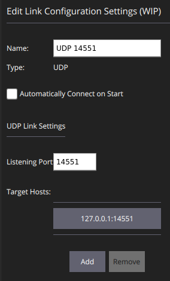

## Instructions to Run emulation in the Software-in-the-loop
## 1. Run DroneKit
* Install `dronekit` (do it only once):

  ````
  pip install dronekit-sitl
  ````

* Run `dronekit-sitl copter` using the followng command: 
    * for `SA`
        ```bash
        killall dronekit-sitl 
        dronekit-sitl copter-3.3 --home=-38.029992,141.178322,17.7,0  --model=quad & python
        ```
    * for `NSW`
        ```bash
        killall dronekit-sitl 
        dronekit-sitl copter-3.3 --home=-30.372985,152.862217,119.1354,0  --model=quad & python
        ```

* Press `Enter`, then copy paste the following command:

```python
print "Start simulator (SITL)"
from dronekit import connect, VehicleMode, LocationGlobal, LocationGlobalRelative
import dronekit_sitl
import time
import math
# Import DroneKit-Python
from dronekit import connect, VehicleMode, Command, LocationGlobal, LocationGlobalRelative
from pymavlink import mavutil # Needed for command message definitions
# Connect to the Vehicle.
vehicle = connect('tcp:127.0.0.1:5760', wait_ready=True)
vehicle.groundspeed = 10

# Get some vehicle attributes (state)
print "Get some vehicle attribute values:"
print " GPS: %s" % vehicle.gps_0
print " Battery: %s" % vehicle.battery
print " Last Heartbeat: %s" % vehicle.last_heartbeat
print " Is Armable?: %s" % vehicle.is_armable
print " System status: %s" % vehicle.system_status.state
print " Mode: %s" % vehicle.mode.name    # settable

# Copter should arm in GUIDED mode
```

## 2. Run UDP fork in folder io_proxy
```bash
cd ../io_proxy && cargo run --release -- tcp:127.0.0.1:5763 14551 14552
```

## 3. Run QGroundControl.AppImage: 

* Download [QGroundControl.AppImage](https://s3-us-west-2.amazonaws.com/qgroundcontrol/latest/QGroundControl.AppImage).

* Install using the terminal commands:

  ````bash
  chmod +x ./QGroundControl.AppImage
  ./QGroundControl.AppImage  (or double click)
  ````

* Open `QGroundControl`, go to `Comm Links` Tab, Add `UDP 14551` Port 

  

* Connect to port `14551`

* Connecto to Vehicle `1`

* Arm and take off to `80` meters for `SA` and `400` meters for `NSW`.

## 4 Run telemetry_host in telemetry_host
* Currently _Telemetry host_ requires a nightly version (2018-12-03) of Rust to compile. If you are using [rustup](https://rustup.rs/) (recommended) to manage your Rust installation, run the following command to configure the build environment: (do it only once)

  ```
  rustup override set nightly-2018-12-03
  ```

* Run the telemetry host:
```bash
cd ../telemetry_host &&  cargo run --release config.json | tee  log.txt
```

## 5. Use Matlab to control

Run the `Main_Program.m` to perform the jointly tracking and planning algorithm in 3D. Configure `model` in line `17` according to different search area:
* For `SA`: 
  ```
    model = gen_model('Use2Ray', false,'current_url',current_url,'Use3D',true,'ChangeHeight', false,...
                  'mdp_cycle', 10,'UseDEM', false,'DEM_FileName', 'DEM_SA_Table');
  ```
* For `NSW`: 
  ```
    model = gen_model('Use2Ray', false,'current_url',current_url,'Use3D',true,'ChangeHeight', false,...
                  'mdp_cycle', 10,'UseDEM', false,'DEM_FileName', 'DEM_NSW_Table');
  ```