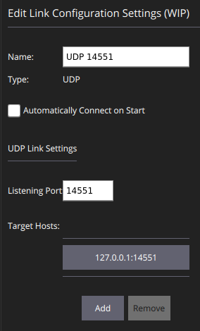

## 1. Run IO Proxy Tool

* **Purpose**: forward /dev/ttyUSB0 data to port 14551 which connects to QGroundControl in step 2.
* Turn on the drone
* Connect 3DR radio telemetry to your computer
* Then run the following command:

```
cd ../io_proxy && cargo run &&
cargo run --release -- serial:/dev/ttyUSB0 14551 14552
```
## 2. Run QGroundControl.AppImage:

- Download [QGroundControl.AppImage](https://s3-us-west-2.amazonaws.com/qgroundcontrol/latest/QGroundControl.AppImage).

- Install using the terminal commands:

  ```bash
  chmod +x ./QGroundControl.AppImage
  ./QGroundControl.AppImage  (or double click)
  ```

- Open `QGroundControl`, go to `Comm Links` Tab, Add `UDP 14551` Port 

  

- Disable all device connections

- Connect to port `14551`

- Connecto to Vehicle `1`

- Arm and take off to `30` meters.


## 3. Run telemetry_host
* Currently _Telemetry host_ requires a nightly version (2018-12-03) of Rust to compile. If you are using [rustup](https://rustup.rs/) (recommended) to manage your Rust installation, run the following command to configure the build environment: (do it only once)

  ```
  rustup override set nightly-2018-12-03
  ```

* Connect your computer to Edison through Wifi network (need to setup Edison as a Wifi hotspot). Then run the `telemetry_host`:

```bash
cd ../telemetry_host &&  cargo run --release config.json | tee  log.txt
```

### 4. Configure using Insomnia

* Download `Insomnia` @ https://insomnia.rest/
* Load the configuraation files from `Config/Trackerbots_Config.json`

* Configure `pulse_server` in the Edison for difference SDR: `HackRF` or `Airspy` in the config file:

  ```bash
  cd ~/TrackerBots/pulse_server/config/
  nano task.json
  -------------------------------------------------------------------
  {
      // The TCP binding address to use
      "addr": "127.0.0.1:11000",
  
      // The mode to run the pulse server in
      // One of: `HackRF`, `Airspy`, `Test { "rate_ms": 1000, "freq": 150e6 }`
      "mode": "HackRF"
  }
  ```

* Check if you can read the pulse using `Latest Pulse` tab in `Insomnia`. If no pulse, using ssh to restart the Pulse server on Edison

  ```bash
  systemctl restart pulse_server # restart pulse server
  journalctl -u pulse_server # check if pulse server is working, press z to go the last line
  ```

## 5. Use Matlab to control

Run the `Main_Program.m` with the following notes:

- Set `model.current_mode = model.modes{3}` in line `23`for a real drone.
- Remember to update target locations based on its gps coordiates starting at line 42 of the `Main_Program.m` file
- Remember to update target frequency and its power reference in line 130 of `gen_model.m` file.